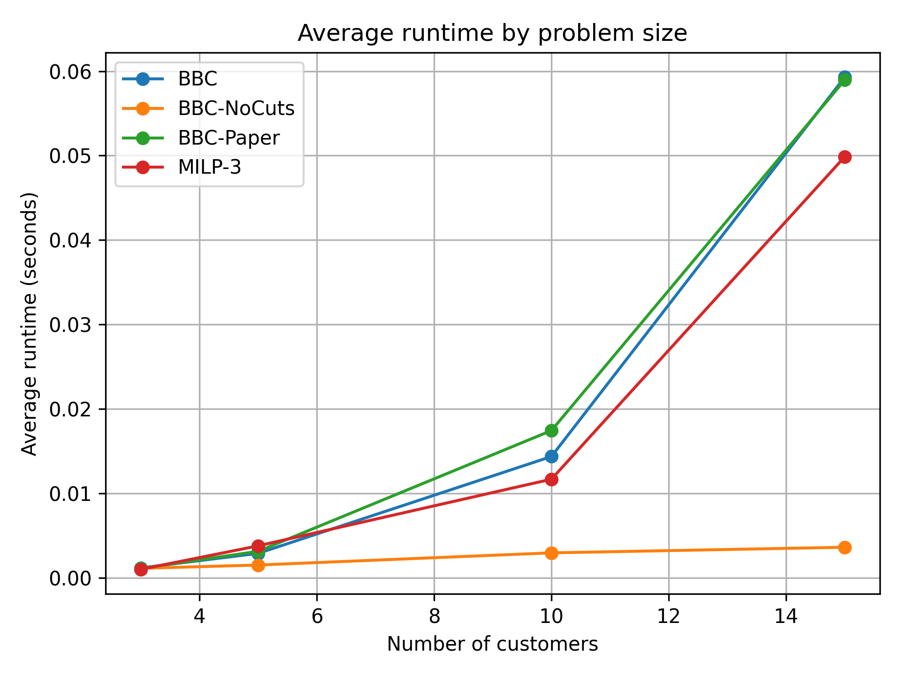
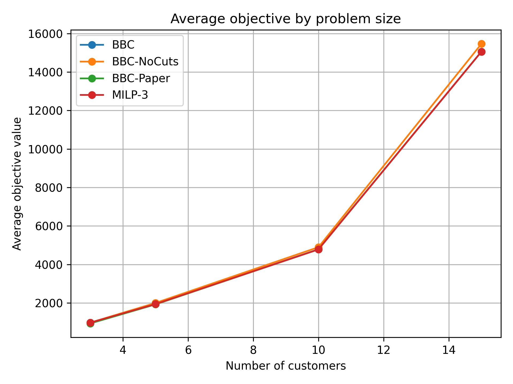
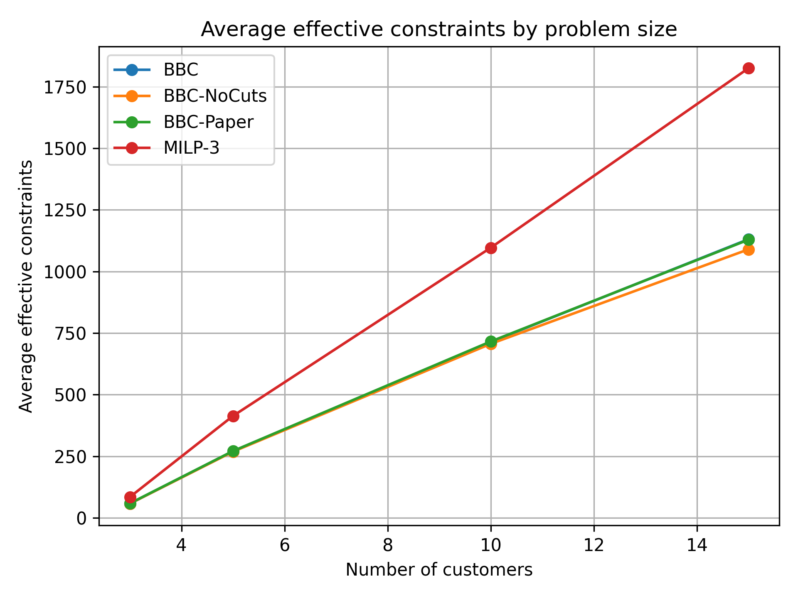
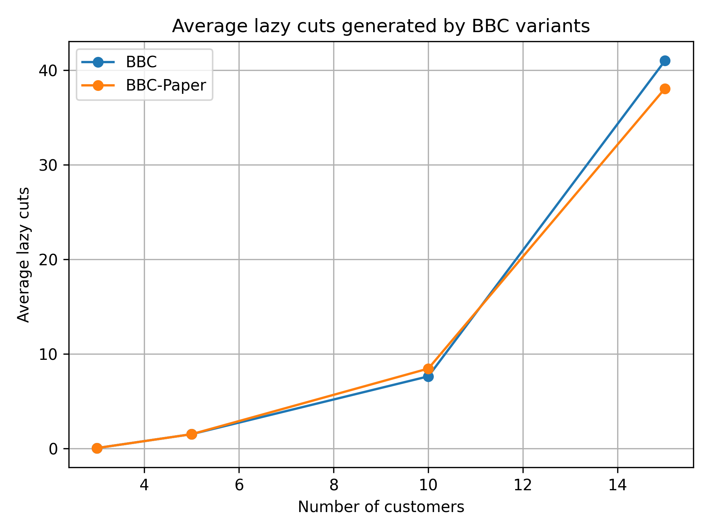

# Facility Location and Pricing Problem (FLMPr)

[](https://www.python.org/)
[](https://www.gurobi.com/)
[]()

An exact optimization framework for the **Facility Location and Pricing Problem (FLMPr)** using Mixed Integer Linear Programming (MILP) and a Branch-and-Cut (BBC) algorithm implemented in **Python** and **Gurobi**.

The project reproduces and extends the exact solution approaches proposed in

> **Facility location and pricing problem: Discretized mill pricing model and exact solution approaches**
>
> European Journal of Operational Research, 2023.

---

# Overview

The Facility Location and Pricing Problem (FLMPr) integrates three strategic decisions into a single optimization model:

- Facility location
- Price selection
- Customer assignment

Unlike the classical facility location problem, customer behavior depends on both the selected facility and its selling price.

Each customer chooses the available facility-price option with the minimum perceived cost while satisfying a budget constraint.

---

# Mathematical Background

For customer \(i\), facility \(j\), and price level \(k\),

\[
\theta_{ijk}=p_{jk}+c_{ij}
\]

where

- \(p_{jk}\): selling price
- \(c_{ij}\): access cost
- \(\theta_{ijk}\): total customer cost

A customer can only purchase when

\[
\theta_{ijk}\le B_i
\]

where \(B_i\) denotes the customer's budget.

The objective is to maximize

\[
\text{Revenue}-\text{Facility Opening Cost}
\]

subject to

- facility opening decisions,
- pricing decisions,
- customer-choice equilibrium,
- budget feasibility.

---

# Repository Structure

```text
.
├── data.py
├── model_milp.py
├── model_bbc.py
├── test.py
├── scalability.py
├── summarize_scalability.py
├── plot_scalability.py
│
├── scalability_results.csv
├── summary_results.csv
├── fair_summary_results.csv
│
├── runtime_by_customers.png
├── objective_by_customers.png
├── constraints_by_customers.png
├── lazy_cuts_by_customers.png
│
├── requirements.txt
└── README.md
```

---

# Installation

Clone the repository

```bash
git clone https://github.com/nakhani/flmpr-gurobi-optimization.git
cd flmpr-gurobi-optimization
```

Install dependencies

```bash
pip install -r requirements.txt
```

---

# Requirements

- Python 3.10+
- Gurobi Optimizer
- Active Gurobi License

Official website

https://www.gurobi.com

---

# Implemented Exact Models

The project implements six exact optimization models.

| Model | Description |
|-------|-------------|
| MILP-1 | Original MILP reformulation |
| MILP-2 | Pairwise customer-choice reformulation |
| MILP-3 | Compact MILP formulation |
| BBC-NoCuts | BBC master problem without lazy cuts |
| BBC | Branch-and-Cut with lazy feasibility cuts |
| BBC-Paper | BBC with the preprocessing assumption of the original paper |

---
# Exact Optimization Models

## MILP-1

MILP-1 is the first mixed-integer linear reformulation of the FLMPr.

This formulation explicitly models customer-choice behavior through a set of customer-choice inequalities.

### Characteristics

- Exact formulation
- Suitable for small and medium-size instances
- Moderate number of variables
- Large number of customer-choice constraints

### Advantages

- Produces optimal solutions
- Straightforward implementation

### Limitations

- The number of customer-choice constraints increases rapidly with the problem size.

---

## MILP-2

MILP-2 introduces pairwise customer-choice constraints.

Instead of directly modeling the customer equilibrium, it compares every feasible pair of facility-price options.

### Characteristics

- Exact formulation
- Pairwise customer-choice constraints
- Extremely large formulation

### Advantages

- Exact representation of customer behavior

### Limitations

The number of constraints grows approximately quadratically with the number of facility-price options.

Therefore, MILP-2 is only solved for very small instances in this project.

---

## MILP-3

MILP-3 is a compact reformulation that significantly reduces the number of customer-choice constraints.

Instead of comparing every pair of alternatives, it uses a stronger formulation that preserves exactness while reducing model size.

### Characteristics

- Exact formulation
- Compact model
- Better scalability than MILP-1 and MILP-2

### Advantages

- Much fewer constraints
- Faster solution times
- Used as the primary exact benchmark

---

# Branch-and-Cut (BBC)

The BBC algorithm solves the bilevel problem using lazy constraints.

Instead of adding all bilevel feasibility constraints to the model before optimization, they are generated dynamically during the Branch-and-Bound search.

The algorithm starts from a relaxed master problem and gradually eliminates infeasible bilevel solutions.

---

## BBC Workflow

The overall procedure is

```text
Generate relaxed master problem
            │
            ▼
Solve current MILP node
            │
            ▼
Callback receives incumbent solution
            │
            ▼
Check customer optimality
            │
            ▼
Violation?
      │             │
     Yes           No
      │             │
      ▼             ▼
Generate Lazy Cut   Accept Solution
      │
      ▼
Continue Branch-and-Bound
```

---

## BBC Callback

Whenever Gurobi finds an incumbent integer solution, the callback performs the following steps.

### Step 1

Retrieve the selected facility-price options.

### Step 2

Determine the customer's true best response.

### Step 3

Compare the customer's assignment in the incumbent solution with the true bilevel-optimal assignment.

### Step 4

If the incumbent solution violates customer optimality, generate a Bilevel Feasibility Cut.

The cut is added using

```python
model.cbLazy(...)
```

The optimization then continues with the strengthened formulation.

---

# BBC Variants

Three BBC variants are implemented in this project.

| Model | Lazy Cuts | Force Opening Constraint | Purpose |
|-------|-----------|--------------------------|---------|
| BBC-NoCuts | ✗ | ✗ | Relaxed master problem |
| BBC | ✓ | ✗ | Proposed exact algorithm |
| BBC-Paper | ✓ | ✓ | Reproduces the original paper |

---

## BBC-NoCuts

BBC-NoCuts disables all lazy constraints.

It solves only the relaxed master problem.

Since bilevel feasibility is not completely enforced, the obtained objective value can be larger than the exact optimum.

Therefore, BBC-NoCuts should be interpreted as an upper bound rather than an exact solution method.

---

## BBC

BBC is the main contribution of this implementation.

It dynamically generates only the necessary Bilevel Feasibility Cuts.

Compared with adding all feasibility constraints in advance, this approach

- reduces the initial formulation size,
- decreases memory usage,
- improves scalability,
- maintains exact optimality.

This version is used for all computational comparisons with MILP-3.

---

## BBC-Paper

The original paper assumes that at least one facility must be opened.

Accordingly, BBC-Paper adds the preprocessing constraint

```math
\sum_{j\in J} w_j \ge 1
```

This assumption guarantees that the empty solution cannot be selected.

However, in practical applications this assumption may force the opening of an unprofitable facility, producing negative objective values.

For this reason, the main BBC implementation in this repository removes this assumption, while BBC-Paper is retained for comparison with the published model.

---

# Comparison of Implemented Models

| Property | MILP-1 | MILP-2 | MILP-3 | BBC-NoCuts | BBC | BBC-Paper |
|-----------|:------:|:------:|:------:|:----------:|:---:|:---------:|
| Exact | ✓ | ✓ | ✓ | ✗ | ✓ | ✓ |
| Compact Formulation | ✗ | ✗ | ✓ | ✓ | ✓ | ✓ |
| Lazy Constraints | ✗ | ✗ | ✗ | ✗ | ✓ | ✓ |
| Pairwise Constraints | ✗ | ✓ | ✗ | ✗ | ✗ | ✗ |
| Force Opening | ✗ | ✗ | ✗ | ✗ | ✗ | ✓ |
| Suitable for Large Instances | Limited | No | Moderate | Yes | Yes | Yes |

---

# Main Differences from the Original Paper

Compared with the original publication, this implementation introduces several improvements.

- Implementation of BBC-NoCuts for comparison.
- Optional preprocessing assumption (`force_open`).
- Automatic scalability analysis.
- Automatic summary generation.
- Fair comparison between exact models.
- Runtime and objective standard deviations.
- Effective constraint statistics.
- Computational plots generated directly from experiments.
- Complete reproducibility using random seeds.

---

# Computational Experiments

The computational study is divided into three consecutive stages.

```text
scalability.py
        │
        ▼
scalability_results.csv
        │
        ▼
summarize_scalability.py
        │
        ▼
summary_results.csv
fair_summary_results.csv
        │
        ▼
plot_scalability.py
        │
        ▼
Computational Figures
```

---

# Step 1 — Running Scalability Experiments

Run

```bash
python scalability.py
```

This script performs all computational experiments.

For every problem size, it generates several random instances using different random seeds, budget parameters, and facility opening costs.

Each generated instance is solved by all applicable exact optimization models.

---

## Experimental Parameters

The experiments use

```python
seeds = [1,2,3,4,5]

lambda_budget = [0.5,1.0,1.5]

fixed_cost = [50,100,200]
```

The tested problem sizes are

| Customers | Facilities | Price Levels |
|-----------:|-----------:|-------------:|
| 3 | 2 | 5 |
| 5 | 3 | 10 |
| 10 | 4 | 10 |
| 15 | 5 | 10 |
| 20 | 6 | 10 |

---

# Models Executed

Depending on the instance size, the following models are executed.

| Model | Execution Rule |
|--------|----------------|
| MILP-2 | Very small instances only |
| MILP-1 | Small and medium instances |
| MILP-3 | All benchmark instances |
| BBC-NoCuts | Always |
| BBC | Always |
| BBC-Paper | Always |

---

# Raw Experimental Results

All experimental results are stored in

```text
scalability_results.csv
```

Each row corresponds to one optimization run.

---

# Columns of scalability_results.csv

| Column | Description |
|---------|-------------|
| model | Optimization model |
| formulation | Internal formulation name |
| seed | Random seed used for instance generation |
| lambda_budget | Budget scaling parameter |
| fixed_cost | Facility opening cost |
| n_customers | Number of customers |
| n_facilities | Number of candidate facilities |
| n_price_levels | Number of price levels |
| n_options | Number of facility-price combinations |
| status | Gurobi optimization status |
| objective | Objective value |
| runtime | Running time (seconds) |
| mip_gap | Gurobi optimality gap |
| gap_percent | Gap expressed as percentage |
| solved_optimal | Whether optimality was proven |
| opened_facilities | Number of opened facilities |
| served_customers | Number of served customers |
| service_rate | Percentage of served customers |
| served_demand | Total served demand |
| total_revenue | Total revenue |
| total_opening_cost | Total facility opening cost |
| lazy_cuts_added | Number of generated lazy cuts |
| node_count | Number of explored Branch-and-Bound nodes |
| best_bound | Best dual bound |
| num_vars | Number of decision variables |
| num_constraints | Initial number of constraints |
| base_constraints | Constraints before lazy cuts |
| effective_constraints | Base constraints plus generated lazy cuts |
| use_cuts | Indicates whether lazy cuts are enabled |
| force_open | Indicates whether the preprocessing constraint is enabled |

---

# Effective Constraints

The BBC formulation dynamically generates lazy constraints during optimization.

Therefore,

```text
NumConstrs
```

reported by Gurobi only counts the initial constraints.

To better represent the actual optimization model, this project reports

```text
effective_constraints
=
base_constraints
+
lazy_cuts_added
```

This quantity approximates the total number of constraints handled during the Branch-and-Cut process.

---

# Step 2 — Result Summarization

Run

```bash
python summarize_scalability.py
```

Two summary files are generated.

```text
summary_results.csv

fair_summary_results.csv
```

---

# summary_results.csv

This file summarizes all experimental results.

For every combination of

- model
- instance size
- budget parameter
- opening cost

the following statistics are computed.

| Statistic | Description |
|-----------|-------------|
| Mean | Average value |
| Standard Deviation | Stability across repeated experiments |

The reported statistics include

- Objective
- Runtime
- MIP Gap
- Lazy Cuts
- Branch-and-Bound Nodes
- Constraint Counts
- Revenue
- Opening Cost
- Service Rate

---

# Why Mean and Standard Deviation?

Each instance is solved multiple times under different random seeds.

Reporting only the average value is insufficient.

For example,

Runtime values

```text
0.12
0.13
0.12
0.11
0.12
```

have

```text
Mean = 0.12

Std ≈ 0
```

which indicates a highly stable algorithm.

On the other hand,

```text
0.01
0.80
0.10
0.45
0.02
```

may have a similar mean but a much larger standard deviation.

Therefore,

- Mean measures average performance.
- Standard deviation measures robustness and stability.

---

# Fair Comparison

MILP formulations are not executed for every problem size.

Therefore, directly averaging all runs may produce unfair comparisons.

To address this issue,

```text
fair_summary_results.csv
```

keeps only those experimental instances that are solved by all primary comparison models.

The compared models are

- MILP-3
- BBC
- BBC-NoCuts
- BBC-Paper

This guarantees that all reported averages are computed over identical experimental instances.

---

# Step 3 — Plot Generation

Run

```bash
python plot_scalability.py
```

The plotting script reads

```text
fair_summary_results.csv
```

and generates four computational figures.

---

# Generated Figures

## Runtime

```text
runtime_by_customers.png
```



Shows the average runtime as the number of customers increases.

---

## Objective Value

```text
objective_by_customers.png
```



Compares the objective values obtained by all exact formulations.

BBC and MILP-3 produce identical objective values on common instances.

---

## Effective Constraints

```text
constraints_by_customers.png
```



Shows how the number of effective constraints grows with problem size.

For BBC,

effective constraints include dynamically generated lazy cuts.

---

## Lazy Cuts

```text
lazy_cuts_by_customers.png
```



Illustrates how many Bilevel Feasibility Cuts are generated during optimization.

---

# Main Computational Findings

The computational experiments demonstrate that

- MILP-2 is only practical for very small instances.
- MILP-3 provides the strongest exact MILP benchmark.
- BBC produces exactly the same optimal objective values as MILP-3.
- BBC-NoCuts provides only a relaxed upper bound.
- BBC dynamically generates only the necessary Bilevel Feasibility Cuts.
- BBC significantly reduces the initial formulation size.
- Effective constraints remain substantially lower than an equivalent formulation containing all feasibility cuts from the beginning.
- Standard deviations indicate that BBC exhibits stable computational performance across repeated experiments.

---

# Recommended Execution Order

```bash
python scalability.py

python summarize_scalability.py

python plot_scalability.py
```

This sequence reproduces all computational experiments, summary tables, and figures reported in this repository.